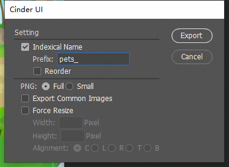
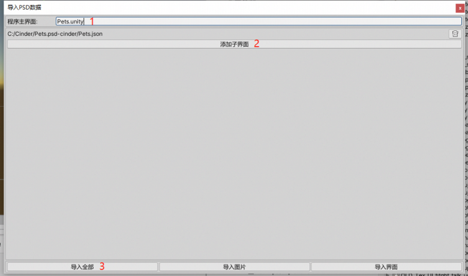
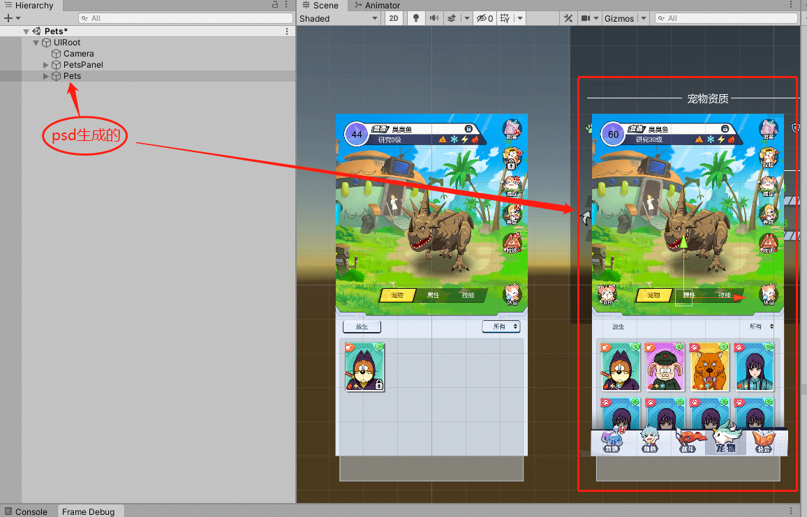
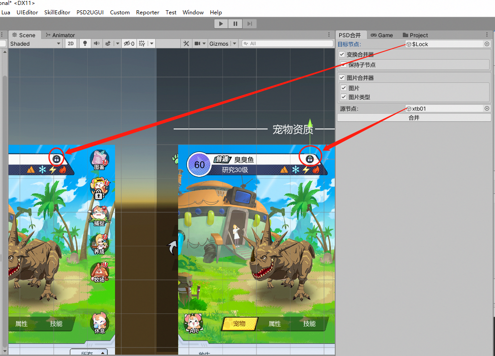

##新版UI替换流程
###1.美术

####(1)通用资源上传SVN

####(2)导出psd
* 完成psd之后,美术点击导出脚本，选中IndexicalName,填上Prefix(导出图片名字的前缀),最后点击Export。

  
* 美术将在导出的图中删除公有图片,最后把导出生成的"xxx.psd-cinder"目录打包发给程序。

###2.程序

####(1) 导入psd

* 选择PSD2UGUI -> 导入PSd数据，弹出下图界面。按照图上标机顺序操作。
  
  
  
* 导入成功后可以看到下图，选择的程序主界面上增加了由psd生成的UI结构。

  
  
* "xxx.psd-cinder"目录下assets资源的私有图片会放入到"Cinder\Assets\Daisy\RawResources\UI\Image"下界面对应的目录下。

####(2) 合并控件
* 从程序创建的UI结构中选中一个目标节点,从由psd生成的UI结构一个源节点,点击合并。(选中控件建议使用基础工具栏中的Rect Tool)
  
  
  
####(3) 合并选项
* 通用合并器
    - [x] **变换合并器:** 勾选后合并会将源节点的`大小`和`坐标`合并至目标节点;
       - [x] **保持子节点:** 勾选后合并子节点的位置和大小不随父节点变化而变化;
    
 * 文本合并器
    - [x] **文本内容:** 勾选后合并会将源节点的`Text(文本内容)`合并至目标节点;
    - [x] **字体:** 勾选后合并会将源节点的`Font(字体)`合并至目标节点;
    - [x] **字号大小:** 勾选后合并会将源节点的`FontSize(字号大小)`合并至目标节点;
    - [x] **文字颜色:** 勾选后合并会将源节点的`Color(文字颜色)`合并至目标节点;
    - [x] **水平溢出:** 勾选后合并会将源节点的`Horizontal Overflow(水平溢出)`合并至目标节点;
    - [x] **垂直溢出:** 勾选后合并会将源节点的`Vertical Overflow(垂直溢出)`合并至目标节点;
 
 * 图片合并器
    - [x] **图片:** 勾选后合并会将源节点的`Source Image(图片资源sprite)`合并至目标节点;
    - [x] **图片类型:** 勾选后合并会将源节点的`Image Type(图片类型type)`合并至目标节点;
    
  * 文本合并器【TextMeshPro】
     - [x] **文本内容:** 勾选后合并会将源节点的`Text(文本内容)`合并至目标节点;
     - [x] **字体:** 勾选后合并会将源节点的`Font(字体)`合并至目标节点;
     - [x] **字号大小:** 勾选后合并会将源节点的`FontSize(字号大小)`合并至目标节点;
     - [x] **文字颜色:** 勾选后合并会将源节点的`Color(文字颜色)`合并至目标节点;
    
 ####(4) 注意事项
 * 程序在`750*1334`完成所有控件合并后,需要把分辨率调整为`750*1624`后查看UI布局是否正常,如有问题需要调整,保证在`750*1334`和`750*1624`分辨率下都是正常才行。
     