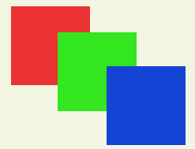

# UI制作规范与渲染优化
>**材料与思路由引擎技术部 周升腾 支持。**

UI规范与优化，其目标是**提升游戏运行时的FPS**，手段是尽量**减少Draw Call数量（降低GPU压力）**和**限制Rebuild、Rebatch次数（降低CPU压力）**。

- 优化时得益于图集的合理性，除了提升FPS，也能少量降低内存占用。
- Draw Call是为了降低GPU压力，但在过程中有时Draw Call优化过多，反而增加CPU等的负担，得不偿失。因此要依据实际情况合理优化。

## Draw Call优化

### 概述
减少Draw Call就是要有更多的图片渲染可以自动和批。
而决定UI元素网格能否自动和批的三个关键分别是：**Texture**、**Material**和**UI Depth**。

- Texture：项目中，该属性即为加载的图集。如果两张图来自于同一图集则代表这一条件通过。
- Material：该属性代表UI所用的材质，若相同则此条件满足。
- UI Depth：该属性表示三张Image所在的UI深度，若相同则表示满足。

上面三个条件同时满足时，则两个对象可以和批，Draw Call数-1。

> 除了上面三个大条件，仍然有两个小点需要注意
> 1. UI元素Position Z值的设置，如果Z！=0，UI不处于Canvas平面内，则UI无法Batch。
> 2. UI元素Rotation X值、Y值的设置，如果导致UI元素不处于Canvas平面内，则UI无法Batch。

**Material**很好理解，就是材质，也一般就用默认的不去做改动；**Texture**则需要在打图集的时候尽量优化其策略，最主要两点就是：1. 充分利用空间。2. 尽量保证需要同时加载的图片来自同一图集。
那么**UI Depth**呢？这里用一个例子来解释。

### UI Depth计算过程
这里通过3个Image UI来说明计算过程，它们互相重叠，关系如下：



(1) 如果redImage，greenImage，blueImage的材质与纹理均相同，符合Batch条件，UI Depth处于同一层。

UI Name | Material | Texture | UI Depth
------------- | ------------- | ------- | --------
redImage  |  A  | A   | 0
greenImage  | A  | A  | 0
blueImage | A | A | 0

(2) 如果redImage与blueImage使用相同材质纹理，UI Depth处于不同层。

UI Name | Material | Texture | UI Depth
------------- | ------------- | ------- | --------
redImage  |  A  | A   | 0
greenImage  | B  | B  | 1
blueImage | A | A | 2

(3) 如果redImage，greenImage，blueImage使用不同材质纹理，UI Depth处于不同层。

UI Name | Material | Texture | UI Depth
------------- | ------------- | ------- | --------
redImage  |  A  | A   | 0
greenImage  | B  | B  | 1
blueImage | C | C | 2

(4) 如果redImage，greenImage使用相同材质纹理，blueImage与前两个UI处于不同层。

UI Name | Material | Texture | UI Depth
------------- | ------------- | ------- | --------
redImage  |  A  | A   | 0
greenImage  | A  | A  | 0
blueImage | B | B | 1

### 总结

有了上面的例子，应该就能很好的理解UI Depth的计算过程。那么优化思路也就明确了，就是不能让不同材质和贴图的UI元素打断自动和批。
总结下来就是：**保持材质统一性，尽量让同一图集的UI元素放在同一父节点下**。

## Rebuild与Rebatch限制

> **渲染是GPU的工作，而在它之前CPU端的Prepare工作也同样需要关注与优化。**

Rebuild与Rebatch是什么？
在CPU端，一个Canvas负责把它上面的UI元素合并成批次，生成合适的渲染命令，发送给Unity的图像系统，当Canvas需要被重绘时，则被标记为Dirty，触发Rebuild，Rebatch。

- Layout Rebuild主要是布局组件对Dirty元素重新布局，来控制UI元素的位置与大小。
- Graphic Rebuild主要是UI元素的网格，材质，纹理等发生了变化，由此需要重建UI元素网格。
- Rebatch主要是重新计算并合并UI元素网格，合批生成Drwa Call发送给Unity的渲染管线。

### Layout Rebuild

UGUI中涉及到Layout的组件主要有ContentSizeFitter、VerticalLayoutGroup、HorizontalLayoutGroup、 AspectRatioFitter、GridLayoutGroup、LayoutElement。
        
这些组件在GetChildSizes()方法中拿到每个元素的区域，并在LayoutUtility. GetLayoutProperty()方法中，把每个实现ILayoutElement接口的对象的信息取出来，进行自动布局。

它有这些性能开销：
- 每个使Layout变脏的UI元素都会至少执行一次GetComponents()调用，它会在布局元素父对象上寻找有效的Layout组件，这是一个向上For循环的遍历过程，直到找到有效组件或到达根部分，然后SetLayoutDirty()，进行Rebuild。
- 要重新计算包含一个或多个Layout组件合适的位置(大小)，会将这些UI 按照Hierarchy中的深度，对Dirty的Layout UI元素排序，层次结构中高的项排在前面，然后按照排序结果进行计算。

总的来说：它们会带来额外的性能损耗，但仍然可以与其带来的开发效率提升相权衡

### Graphic Rebuild

UGUI被标记为dirty，除了SetLayoutDirty()外，还有SetVerticesDirty()、SetMaterialDirty()，而且如果调整了UI元素在Hierarchy中的父节点，还会调用OnTransformParentChanged() ，通过SetAllDirty()方法将该UI加入“Rebuild队列”。

- 如果UI顶点数据被标记为dirty，就会导致网格重建(例如UI的RectTransform改变了大小)。
- 如果材质数据被标记为dirty，附加的Canvas Render的材质将被更新(例如UI的材质或者纹理被更改)。

> 通常来说，Graphic Rebuild比Layout Rebuild更耗费性能。

在优化Rebuild时，我们可以通过函数反射监听m_LayoutRebuildQueue与m_GraphicRebuildQueue队列，来确定哪些操作会导致UI的Rebuild。

```
        System.Type type = typeof(CanvasUpdateRegistry);
        FieldInfo field = type.GetField("m_LayoutRebuildQueue", BindingFlags.NonPublic | BindingFlags.Instance);
        m_LayoutRebuildQueue = (IList<ICanvasElement>)field.GetValue(CanvasUpdateRegistry.instance);
        field = type.GetField("m_GraphicRebuildQueue", BindingFlags.NonPublic | BindingFlags.Instance);
        m_GraphicRebuildQueue = (IList<ICanvasElement>)field.GetValue(CanvasUpdateRegistry.instance);
```

### Rebatch

- Batch是指Canvas合并UI元素的网格，然后生成Draw Call发送给Unity的渲染管线的过程，**Batch的结果会被缓存，直到UI重新标记为Dirty**。
- 动态的更新UI元素，如网格变化、UI层级变化等都会使其变为Dirty，Canvas使用的网格是从CanvasRenderer上获取，计算Batch需要按照网格的深度，是否遮挡，是否共享材质等方面进行排序。
- 此操作是多线程的，因此不同的CPU结构，执行的性能也不同。

### 总结

1. UGUI的Layout组件会造成额外的性能开销，可以考虑编写自定义代码来进行布局。
2. Rebuild需要反射监听队列来跟踪优化。
3. 动静分离能很好限制Rebuild和Rebatch次数。

## 其他细则

1. Raw Image不会与Image和批，但更为轻量，通常用于背景图这类大图。
2. 不要使用Outline，它将顶点拷贝了四份。
3. 不要使用Image Tiled，它生成了大量网格。
4. 不要使用Mask 和 RectMask2D，它们不仅会影响合批，还会导致其他额外的性能开销。
5. 结合实际情况，选择使用SetActive，设置Culling Layer或Destroy。
